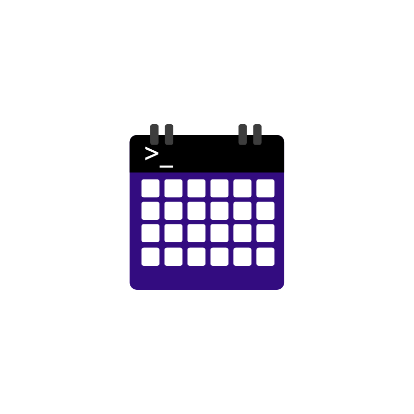

# Chronx
<div align="center">


 
[](https://pkg.go.dev/github.com/Sindhuinti/chronx)
</div>

Chronx is a command line tool that allows you to access your Google Calendar(s) from a command line. It's easy to get your events, search for events, add new events, delete events. from your terminal without any extra clicks. 

To install the Chronx CLI, use the command `go install github.com/sindhuinti/chronx@latest`. Go will automatically install it in your $GOPATH/bin directory, which should be in your $PATH.

Once installed, you can use the Chronx CLI command.

> **Note** If you are getting an error like `command not found: chronx`, then you need to add `$GOPATH/bin` to your `$PATH` environment variable. 

## Features
- OAuth2 authention with your Google account
- list your calendars
- add event to calendar
- show details of event
- delete an event
- flag file support for specifying option defaults

## How to use

```bash
Chronx is a CLI tool that offers a set of commands for managing your calendar events with ease!

Usage:
  chronx [command]

Available Commands:
  add         Add new event to user's calendar
  delete      Delete an existing event in user's calendar
  help        Help about any command
  init        Add user's google calendar oauth token
  list        Get list of events from user's calendar

Flags:
  -h, --help      help for chronx
  -v, --version   version for chronx

Use "chronx [command] --help" for more information about a command.
```

### usage
chronx provides a series of subcommands with the following functionality:

```bash
init         oauth the user account
add          add new event to calendar
list         list upcoming event
delete       delte an event
help         help about any command
version      get version of the tool
```

### Login information

OAuth2 is used for authenticating with your Google account. The resulting token is placed in the `%LOCALPATH%\chronxToken` file in windows and `/tmp/chronxToken` file in linux (or) macOS. When you first start chronx using  `chronx init` command, the authentication process will proceed. Simply follow the instructions.

You currently have to use your own Calendar API token. Our Calendar API token is restricted to few users only and waits for Google's approval to be unlocked.

1. [Create a New Project](https://console.cloud.google.com/projectcreate) within the Google developer console
2. Enable the [Google Calendar API](https://console.cloud.google.com/apis/api/calendar-json.googleapis.com)
3. [Create OAuth2 consent screen](https://console.cloud.google.com/apis/credentials/consent/edit;newAppInternalUser=false) for an "Desktop Application".
4. [Create OAuth Client ID](https://console.cloud.google.com/apis/credentials/oauthclient)
5. Grab your newly created Client ID and Client Secret from the Credentials page.
6. Set these google credientials as Environmental varibales in your system and call `chronx init` command.
> **Note** ClientID as `CHRONXID` and client secret as `CHRONXSECRET`

7. This should provide with a link to open it in your default browser.

## License
This project is licensed under the Apache-2.0 license - see the [LICENSE](https://github.com/Sindhuinti/chronx/blob/main/LICENSE) file for details.

## Support

Don't forget to leave a star ⭐️.