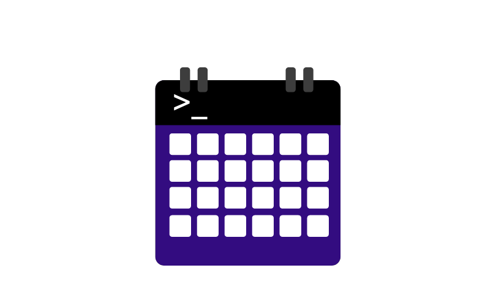

# Chronx

Chronx is a command line tool that allows you to access your Google Calendar(s) from a command line. It's easy to get your events, search for events, add new events, delete events. from your terminal without any extra clicks. 

To install the Chronx CLI, use the command `go install github.com/sindhuinti/chronx@latest`. Go will automatically install it in your $GOPATH/bin directory, which should be in your $PATH.

Once installed, you can use the Chronx CLI command.

> **Note** If you are getting an error like `command not found: chronx`, then you need to add `$GOPATH/bin` to your `$PATH` environment variable. 
